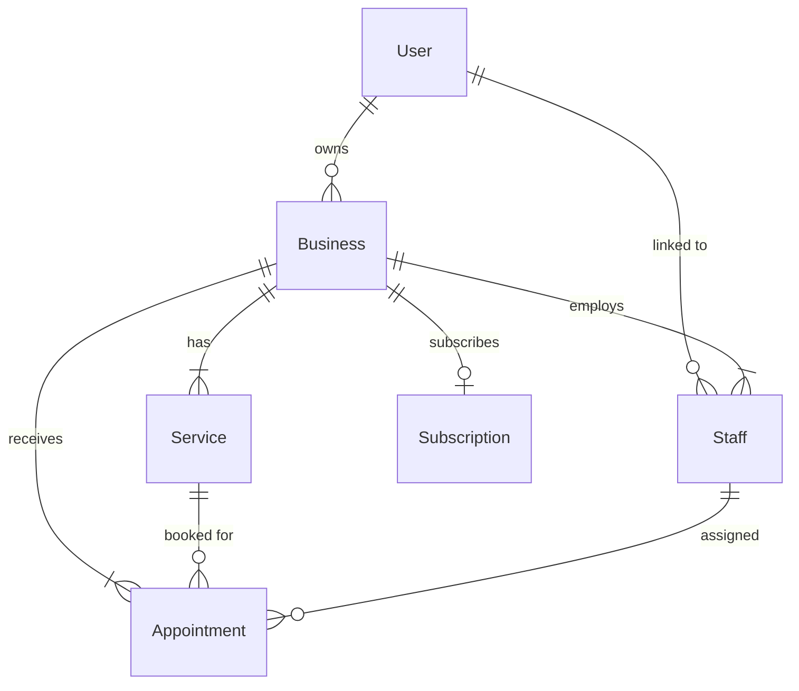

# Puragenda — Architecture Documentation

## Overview

Puragenda is a multitenant SaaS for appointment scheduling built by PuroCode. It provides businesses with a white-label booking widget, collision detection, and a management dashboard.

**Stack**: Next.js 16 (App Router) · Prisma · PostgreSQL · Zod · date-fns-tz · Tailwind CSS

---

## Directory Structure (DDD-Lite)

```
src/
├── core/                     # Pure business logic (no frameworks)
│   ├── constants.ts          # App-wide constants (roles, plans, defaults)
│   ├── entities/index.ts     # TypeScript domain types
│   └── validators/           # Pure validation functions
│       ├── date-utils.ts     # Time overlap algorithm
│       └── slug.ts           # Slug generation
│
├── server/                   # Server-side only (Prisma, auth, validations)
│   ├── db/prisma.ts          # Prisma client singleton
│   ├── auth/
│   │   ├── session.ts        # HMAC token creation & verification
│   │   └── user-session.ts   # Cookie-based user resolution
│   ├── services/             # Business logic with DB access
│   │   ├── auth.service.ts   # Register, login (transactional)
│   │   ├── business.service.ts
│   │   ├── service.service.ts
│   │   ├── staff.service.ts
│   │   └── appointment.service.ts  # Collision detection
│   └── validations/
│       ├── auth.ts           # Zod schemas for login/register
│       └── booking.ts        # Zod schemas for booking/services
│
├── components/               # React components
│   ├── ui/                   # Atoms (shadcn/ui)
│   ├── dashboard/            # Admin panel components
│   └── widget/               # (Reserved for widget sub-components)
│
├── hooks/                    # Reusable state hooks
│   └── use-widget-wizard.ts  # Widget wizard state machine
│
└── lib/                      # Shared utilities
    ├── utils.ts              # cn(), formatPrice()
    └── date.ts               # Timezone-aware date helpers (date-fns-tz)

app/                          # Next.js App Router
├── page.tsx                  # Landing page
├── layout.tsx                # Root layout
├── login/                    # Auth pages
├── register/
├── dashboard/                # Protected admin area
│   ├── layout.tsx            # Sidebar + auth check
│   ├── page.tsx              # Appointments overview
│   ├── services/             # Service CRUD
│   └── settings/             # API keys, widget embed
├── widget/[slug]/            # Public booking widget
└── api/                      # API routes
    ├── auth/                 # Login, register, logout, me
    ├── dashboard/            # Protected CRUD endpoints
    └── business/[slug]/      # Public widget endpoints
```

---

## Collision Detection System

### Algorithm

Two time intervals `[A_start, A_end)` and `[B_start, B_end)` overlap if and only if:

```
A_start < B_end AND A_end > B_start
```

This is implemented as a pure function in `src/core/validators/date-utils.ts` and as a Prisma query in `src/server/services/appointment.service.ts`.

### Per-Staff Validation

Collisions are checked **per staff member**, not just per business. This means two different professionals in the same business can have appointments at the same time.

### Database Query

```sql
SELECT * FROM "Appointment"
WHERE "staffId" = $staffId
  AND "status" != 'CANCELLED'
  AND "startTime" < $newEnd
  AND "endTime" > $newStart
LIMIT 1
```

### Compound Index

```prisma
@@index([staffId, startTime, endTime])
```

---

## Widget Integration

### Basic Embed

```html
<iframe
  src="https://your-domain.com/widget/your-slug"
  width="100%"
  height="700"
  frameborder="0"
  style="border-radius: 16px; border: 1px solid #222;"
></iframe>
```

### Custom Colors (White Label)

Pass `?color=HEX` to customize the accent color:

```html
<iframe src="https://your-domain.com/widget/your-slug?color=FF69B4" ...></iframe>
```

**Color Priority:**
1. URL parameter `?color=HEX`
2. Business `brandColor` field in database
3. Default `#0085CB` (PuroCode brand)

### Blocked Slots API

The widget fetches occupied time slots in real-time:

```
GET /api/business/{slug}/appointments?date=2026-04-25
Headers: x-api-key: pg_xxxxx
Response: [{ "startTime": "...", "endTime": "..." }]
```

---

## Authentication & RBAC

### Session Tokens

HMAC-SHA256 signed tokens stored in HTTP-only cookies (`puragenda_session`). 7-day expiration.

### Middleware

`middleware.ts` protects all `/dashboard/*` and `/api/dashboard/*` routes. Public routes (`/`, `/login`, `/register`, `/widget/*`, `/api/business/*`) are open.

### Roles

| Role | Dashboard | Services | Appointments | Settings | API Key |
|------|-----------|----------|-------------|----------|---------|
| OWNER | ✅ | ✅ CRUD | ✅ Confirm | ✅ | ✅ |
| STAFF | ✅ | ✅ Read | ✅ Read | ❌ | ❌ |

---

## CORS & API Key

- CORS is handled dynamically in `middleware.ts`
- Public API routes require `x-api-key` header
- `Business.allowedOrigins` (string array) controls which domains can access the API
- Empty `allowedOrigins` = all origins allowed (development mode)

---

## Database Schema



---

## Timezone Handling

- All dates stored in UTC in PostgreSQL
- `America/Santiago` is the default timezone
- `date-fns-tz` used for conversion in `src/lib/date.ts`
- Widget displays times in business timezone
- DST transitions handled automatically by date-fns-tz
