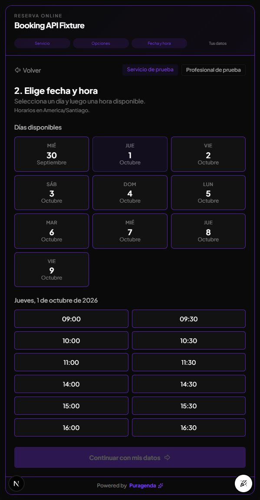
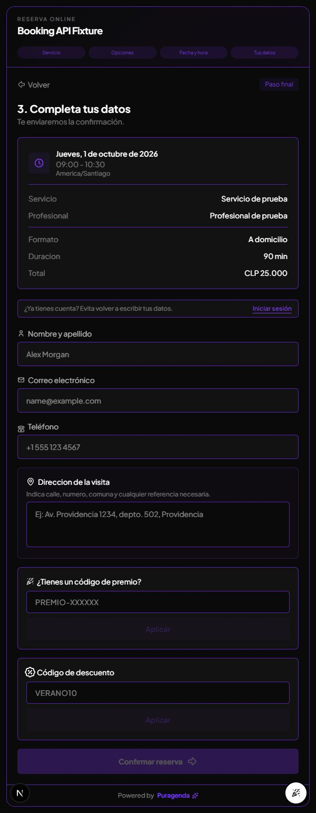

# Verificación local de la API de reservas

Fecha: 30-09-2026. Base auditada: `6f0ab22`. Rama: `feature/public-booking-api`.
No se escribió en producción ni se cambió el repositorio consumidor.

## Navegador

Se abrió `/widget/booking-api-fixture` en el navegador integrado, servido por Next
en loopback puerto 3107. La base usa un esquema efímero en PostgreSQL local
`puragenda_booking_api_test`; negocio, servicio y profesional son fixtures.

Se verificó por interacción real:

1. Un servicio de 60 minutos y CLP 20.000 exige completar la categoría obligatoria.
2. Seleccionar A domicilio cambia el total a 90 minutos y CLP 25.000.
3. El calendario del 01-10-2026 ofrece 09:00, 09:30, 10:00, 10:30, 11:00,
   11:30, 14:00, 14:30, 15:00, 15:30, 16:00 y 16:30.
4. Un GET autenticado a `/availability` devuelve exactamente esos inicios UTC,
   convertidos a America/Santiago, duración 90 y precio 25000.
5. Al seleccionar 09:00, el resumen muestra 09:00–10:30 y exige dirección.
6. No se pulsó Confirmar reserva. No hubo errores de consola en el navegador.

En la primera sesión, la ruta auxiliar de consentimiento respondió 503 porque
su SQL sin esquema no encontraba la tabla de rate limiting del fixture. Se corrigió
el `search_path` del runner local; esa ruta auxiliar no se volvió a comprobar en
navegador. El calendario, la consulta de disponibilidad y el resumen funcionaron
durante la sesión documentada.

## Pruebas reproducibles

`npm run test:booking:local` crea un esquema propio con nombre validado, aplica
la migración SQL real y ejecuta las pruebas con correo, Google y Mercado Pago
simulados. Solo permite loopback y la base con nombre exacto
`puragenda_booking_api_test`. No carga credenciales desde `.env`. El esquema se
elimina al terminar; la base contenedora local permanece. La integración se omite
en `npm test` ordinario para impedir el uso accidental de una conexión real.

`node scripts/test-booking-api-local.mjs --preview` prepara el mismo entorno y
un widget fixture para inspección. `--build` usa esa base para el build completo,
sin acceso a datos productivos. Todos los comandos usan el runtime instalado.

La cobertura incluye autenticación, IDs de otro negocio, filtrado del catálogo,
opciones requeridas/máximos, moneda y duración, sucursales y personal, plan sin
personal público, horarios/pausas/excepciones, cierre, anticipación, mismo día,
DST de Santiago/Nueva York, colisiones entre días, paridad API/widget, primera
disponible, slots vacíos, carrera consulta→reserva, creación concurrente y SQL
directo, idempotencia concurrente/replay/lease/fencing/caducidad/recuperación,
abonos, fallos de pago, revalidación del catálogo al escribir y respuesta legacy.
También comprueba que eliminar físicamente una cita no permita volver a ejecutar
su operación interrumpida y que los logs de correo omitan contactos y errores del proveedor.

Resultados: 49 pruebas de reservas con PostgreSQL local; suite general con 919
pruebas pasadas y 21 omitidas (19 de integración ejecutadas por separado y 2 previas).
Typecheck y build completo correctos. Lint de los archivos modificados: cero errores
y seis warnings anteriores de imágenes del widget.

## Límites conocidos

La recuperación tras caída con efectos externos inciertos devuelve 202 y requiere
revisión; no repite pagos, mensajes ni sincronizaciones. Puede faltar un efecto
externo. No hay una cola de entrega con garantía exactamente una vez. Esto forma
parte del contrato documentado, no una confirmación automática de éxito.

El límite HTTP reutilizado es por proceso/IP; el almacenamiento de idempotencia
y el guard de capacidad son compartidos en PostgreSQL. El despliegue con varias
instancias necesita rate limiting compartido en el gateway.

El lint global tiene un fallo ajeno en
`.agents/skills/media-use/scripts/recipe.mjs:83` (`react-hooks/rules-of-hooks`),
presente en un directorio sin seguimiento ya antes de esta tarea. No se modificó
esa skill ni el resto de cambios ajenos. Los seis warnings `` del widget
también preceden a esta ampliación.

El negocio `estetica-bella` no fue utilizado para fixtures o escrituras; la conexión
de PuroCode, despliegue y aceptación real en dashboard siguen siendo tareas
posteriores con autorización.
