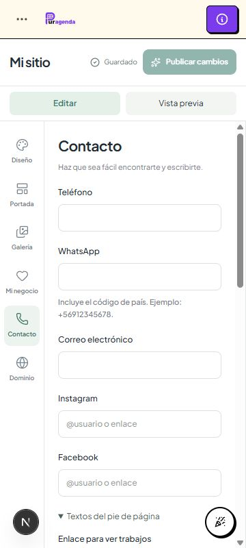

# Entrega final de la auditoría — webs

Estado: hardening completado y validado localmente; listo para revisión de merge. No se realizó merge, push ni deploy. Bella y la distribución del constructor permanecen aprobadas; no se creó Template 02.

| # | Punto solicitado | Resultado final |
| ---: | --- | --- |
| 1 | Estado inicial | webs limpia en 2c81c3fc, coincidente con origin/webs; trabajo directo sobre esa rama |
| 2 | .agents eliminados | **485 archivos retirados del índice**, conservados localmente; 0 actualmente trackeados |
| 3 | .gitignore | /.agents/ y /artifacts/; se conservan reglas de scratch, .next-* y medios locales de QA |
| 4 | Diff vs main | 266 archivos: 108 producto, 5 migraciones, 70 docs, 18 tests, 11 scripts, 16 configuración/traducciones y 38 eliminaciones de tooling. [Inventario exacto](final-diff-inventory.json) |
| 5 | Fallback galería | Manual → imágenes de servicios canónicos del mismo negocio → [] y Portfolio oculto; sin mezclar fuentes |
| 6 | Tests galería | A/B/C/D/E: manual, servicios, render vacío, ausencia de demo y fixture demo explícito; unitarios/render/HTTP |
| 7 | Headline | Hero y publicación usan headline.trim() o fallbackHeadline.trim(); cinco casos de publicación real cubiertos |
| 8 | Validación categorías | Label 1–80 trim, ID y nombre case-insensitive únicos, order entero único en rango, categoryIds referenciados |
| 9 | Legacy categorías | Reparación al leer; escritura estricta; galleryFilters vacíos al guardar; IDs estables y campos de compatibilidad sincronizados |
| 10 | CRUD categorías | Renombrar mantiene ID/asociaciones; eliminar conserva fotos y quita relaciones; multi-category y reorder probados |
| 11 | Ownership dominios | Same projectId no prueba tenant; se bloqueó adopción antes del challenge |
| 12 | Prueba específica | TXT _puragenda.hostname con puragenda-verify=token aleatorio y tenantVerifiedAt; coincidencia exacta |
| 13 | Reconciliación Vercel | Solo posterior al TXT; validar nombre/proyecto, provider verified y DNS; refresh no salta ownership |
| 14 | Tests domains | Mocks TXT/transport + HTTP A/B: hostname único, verify, disconnect y primary; runtime A nunca como B |
| 15 | WebsiteMedia migración | V2 existente incluye tabla, FK, unicidad, índices, CHECK y RLS; verificada tras V1 |
| 16 | Campos WebsiteDomain | V2: provider/dnsRecords/checkedAt; nueva incremental: tenantVerifiedAt y revalidación segura de legacy |
| 17 | Desde baseline | Schema MAIN → cinco migraciones nuevas, checkpoint V1 → V2 y dominio legacy ACTIVE probado |
| 18 | Drift | No difference detected, exit 0; RLS verificado por separado |
| 19 | Abstracción template | WebsiteView<TConfig>, WebsiteBusiness y booking/types neutrales; BellaView y schema propios; registry con callbacks |
| 20 | Dependencias Bella restantes | Renderer/editor/preview protocol/paletas/copy son propios de Bella; registry la registra; metadata usa campos SEO estructurales. Sin otro motor |
| 21 | Media security | Scope DB, rechazo de asset B incluso en legacy, protección draft/published inválido, MIME/decode/EXIF/resize/WebP/rollback |
| 22 | Hardcodes | Copy editorial en config.copy; sistema/validación/booking/units/redes/accessibility permanecen fijos; detalle en BELLA.md |
| 23 | Overflow | 48/48 escenarios PASS de seis paneles × cuatro tamaños × ambos previews; documento, contenedor, iframe; tolerancia 2 px |
| 24 | Tests completos | npm test + ejecución completa con PostgreSQL opt-in; focales de websites/Bella/builder/booking también ejecutados |
| 25 | Total PASS | **1.043 tests, 176 archivos** en ejecución completa aislada |
| 26 | Skipped | **0** en suite con PostgreSQL; npm test normal: 1.022 PASS y 21 opt-in omitidos; no sumar ambas corridas |
| 27 | Lint | 0 errores, 32 advertencias existentes |
| 28 | Typecheck | PASS |
| 29 | Prisma validate | PASS |
| 30 | Prisma generate | PASS |
| 31 | Build | PASS, 133 páginas; salida aislada de producción |
| 32 | HTTP multi-tenant | **47 PASS**: 29 público/DB + 18 acciones autenticadas; medios/domains/draft/preview/suspensión/booking/catálogo |
| 33 | QA desktop | Builder 1440/1280, ambos previews; A y nombres B/C, panel Contacto capturado |
| 34 | QA mobile | Builder 390/360, preview visible y escalado, nombres B/C y header/hero/footer; Contacto 360×800 capturado |
| 35 | Documentación | ARCHITECTURE, BELLA, DOMAINS, BILLING, QA y DELIVERY actualizados; medidas/capturas actuales separadas de historia |
| 36 | Archivos | [Inventario completo](final-diff-inventory.json); producto, migraciones/config, tests, scripts y documentación identificados |
| 37 | Commits | 705d53c4, 8619cae9, d8985ec, 95e60f4, 951df3d, e983386, 6b48972 + commit final de esta evidencia; git log 2c81c3f..webs |
| 38 | Externo pendiente | Aplicar en staging, revalidar TXT legacy, wildcard/routing/TLS, Cloudinary remoto y Paddle sandbox E2E; sin activar infraestructura desde esta auditoría |
| 39 | Sin merge | Confirmado; main no se modificó |
| 40 | Sin deploy | Confirmado; sin compra de dominio, DNS writes, Vercel writes production ni Paddle LIVE |

## Limpieza y límites del diff

La petición de retirar .agents mediante un commit normal y sin reescribir historia deja una diferencia inevitable: main ya contenía 38 archivos Supabase de .agents. En main...webs aparecen **solo sus eliminaciones**, sin contenido nuevo de skills/Hyperframes/audio/assets de herramientas. Las 447 adiciones exclusivas de webs desaparecen del diff. El árbol final no trackea ningún .agents. Evitar también esas 38 líneas de eliminación requeriría conservar tooling en el árbol o alterar historia; no se hizo ninguna de esas dos cosas.

También se retiraron del índice 35 archivos de artifacts, 17 de la historia Remotion local social/puragenda-update-story, cinco capturas SEO ajenas a websites y un prompt local de hotfix, manteniéndolos todos localmente y añadiendo reglas de ignore. skills-lock.json se restauró al contenido de main. Los 12 archivos scratch y las capturas SEO que main ya tenía no son cambios de esta rama. No hay nuevos .next, runtime QA, credenciales ni .env; .env.example es documentación de variables sin secretos. Las imágenes/mediciones en docs/websites/qa son evidencia de producto deliberada, no outputs temporales de runtime.

## Riesgos operativos restantes

Aplicar la migración de ownership devuelve dominios anteriores a PENDING y rota el TXT: sus propietarios deben verificar de nuevo. No se pierde la reserva de hostname ni los snapshots del sitio. WebsiteMedia y campos de V2 ya tenían migración; la única corrección adicional de drift fue ON UPDATE CASCADE de BookingOperation, aplicada incrementalmente.

La baseline requerida por el historial anterior de main está documentada; no se afirma éxito de un replay desde vacío de migraciones preexistentes. La secuencia desde schema MAIN sí tiene cero drift. Los tests no sustituyen staging, prueba de carga, sandbox E2E de Paddle/Cloudinary/Vercel ni comparación visual pixel-perfect. No se efectuaron esas operaciones externas.

Incidencia de correo de QA: el launcher inicial conservaba Resend y una ejecución previa registró dos notificaciones enviadas. Se corrigió el aislamiento del launcher; las ejecuciones finales tienen correo/proveedores reales deshabilitados. Detalle y comandos reproducibles en [QA.md](QA.md).

