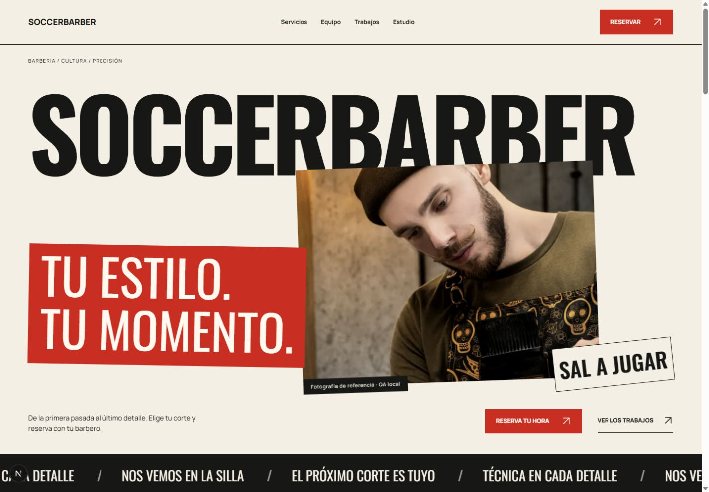
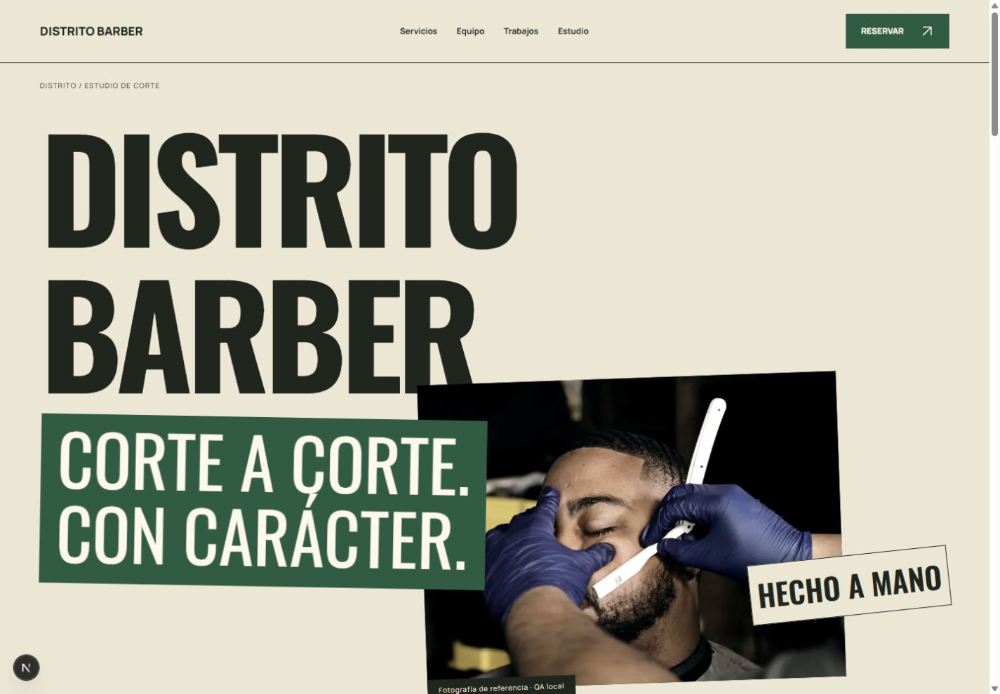
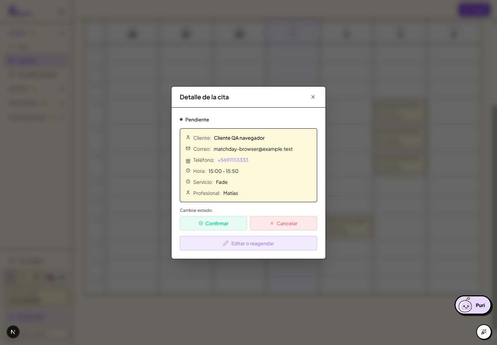

# Entrega — Matchday, Template 02

Fecha: 1 de octubre de 2026. Rama: `webs`. Implementación: `1f2f0f1` (`feat(websites): add Matchday template and preserve template drafts`). La evidencia y este informe se guardan en el commit de documentación posterior. No se hizo merge, push ni deploy.

## Los 45 puntos de entrega

| # | Punto | Resultado y evidencia |
|---|---|---|
| 1 | Estado inicial | Árbol limpio en `webs`; Bella 1 era el único template registrado. Se revisaron las instrucciones del repositorio y las guías instaladas de Next 16 antes de escribir código. |
| 2 | Problemas encontrados | Editor, validación del preview, metadata y transporte de reservas dependían de Bella. Borrador y publicación compartían identidad de template. Además, el primer build incluía CSS y declaraciones de fuentes de ambos diseños. |
| 3 | Desacoplamientos | Primitivas de media, categorías, transporte de preview, cliente/estado/validación/errores de booking y tipos del editor compartidos. Bella conserva reexports compatibles. Los settings visuales siguen perteneciendo a cada template. |
| 4 | Concepto | Matchday tiene energía de campaña editorial: marca condensada grande, fotografía desplazada, panel de acento, índices de servicios y números de profesionales. El fútbol vive en el contenido del tenant. |
| 5 | Tres direcciones | Night Session, Campaign Cut y Studio Index. La comparación de personalidad, complejidad, móvil, reutilización y riesgo de cliché está en `MATCHDAY.md`. |
| 6 | Dirección elegida | Campaign Cut: marfil, tinta y acento; lenguaje de marca expresivo que admite distintos nombres y rubros de grooming. |
| 7 | Referencia 1 | Se tomaron del texto suministrado la oscuridad gráfica, contraste y uso controlado del acento. La imagen original no estaba adjunta. |
| 8 | Referencia 2 | Se tomaron del texto suministrado escala tipográfica, capas de fotografía, ritmo editorial y energía de campaña. La imagen original no estaba adjunta. |
| 9 | Originalidad | Composición, grilla, tipografía, navegación y copy propios. No se copiaron logos, assets, textos ni layout de Freshcut. No hay métricas o testimonios inventados. |
| 10 | Registry | Bella 1 y Matchday 1 declaran schema, defaults, industrias recomendadas, editor, secciones, capacidades, paletas, controles, thumbnails y previews. Versiones desconocidas se rechazan. El adapter tipado valida la config antes de entregar props. |
| 11 | MatchdayConfig | Schema Zod independiente y estricto: copy, paleta, marca, media, galería/categorías, números/frases/visibilidad editorial por ID canónico, marquee, contacto y metadata. No es un cast de BellaConfig. |
| 12 | Editor | Diseño, Portada, Servicios, Equipo, Galería, Mi negocio, Contacto y Dominio. Autosave, bloqueo durante uploads, flush antes de cambiar diseño/publicar, errores y preview inmediato. No muestra el proceso de Bella. |
| 13 | Selector | Ambos templates tienen thumbnail, categoría, preview desktop/mobile con datos del negocio y botón de selección. El actual se identifica como “Tu diseño”. |
| 14 | Switching | Operación tenant-scoped con autorización, lock, revisión optimista y validación de media. Solo cambia el borrador; la identidad publicada cambia al publicar. Primera selección copia campos universales compatibles, posteriores selecciones restauran el snapshot propio. |
| 15 | Preservación Bella | `templateConfigs` usa claves `bella@1` y `matchday@1`. Se probó ida y vuelta en UI con titulares diferentes. `browser-persistence.json` conserva el titular de Bella y la publicación Matchday en revisión 11. Media retenida sigue protegida frente a borrado. |
| 16 | Hero | Nombre configurable sobre retrato desplazado, panel de titular, frase gráfica opcional, eyebrow, caption, intro y dos acciones. Funciona sin foto con tratamiento tipográfico. No tiene imagen demo por defecto. |
| 17 | Tipografía | Oswald para titulares/números y Manrope para lectura, con fallback y `display: swap`. Fuentes hospedadas por Next y variables limitadas al template. |
| 18 | Paletas | Signal, Ice y Terrain. Custom controla acento, texto sobre acento, papel y tinta; publicación exige contraste 4.5:1 en los pares de lectura. Presets y caso inválido cubiertos por tests. |
| 19 | Servicios | Índice editorial con nombre, precio y duración canónicos. Selección cambia foto, detalle y CTA del servicio. Sin foto usa tipografía. Crear/editar servicios se hace en Puragenda. |
| 20 | Staff | IDs, nombres, fotos, especialidades y restricciones del catálogo canónico. Número, frase y visibilidad son solo presentación del sitio. Sin foto muestra inicial. UI QA cambió y restauró el número sin modificar el profesional. |
| 21 | Galería | Grilla asimétrica, categorías editables, filtros, lightbox, alt, caption, encuadre, upload/reemplazo y orden de fotos. Hasta 30 fotos, 20 categorías y 8 categorías por foto. |
| 22 | Fallback | Galería manual tiene precedencia exclusiva; si está vacía usa fotos reales de servicios, deduplicadas; si ambas están vacías se oculta. Distrito usa fallback. Tests cubren las tres ramas. |
| 23 | Booking | UI propia de cinco pasos con progresión numerada y selección de profesional con foto/número. Reutiliza APIs, cotización y writer canónicos; no hay algoritmo nuevo de disponibilidad. Mantiene opciones, multi-servicio, sedes, anyStaff/noStaff, abonos y errores existentes. QA real cubre una reserva individual, restricciones, horarios, colisión, replay idempotente y rechazo entre tenants. |
| 24 | Contacto | Email, teléfono, WhatsApp y redes configurables; dirección/mapa y horarios desde registros reales, con fallback a la sede principal. Datos ausentes se omiten; no se fabrica dirección o mapa. |
| 25 | Footer | Statement editable, columnas que se adaptan a los datos disponibles, horarios, contacto, reserva y crédito Puragenda. No hay bloque vacío de dirección cuando falta el dato. |
| 26 | Movimiento | Entrada de marca y encabezados, crop de imagen de servicio, hover/foco, marquee configurable con pausa. CSS local, sin dependencia nueva de animación. `prefers-reduced-motion` desactiva animaciones/transiciones. |
| 27 | Mobile | Portada revisada a 1440, 1280, 768, 390 y 360 px. Servicios verticales, equipo horizontal, galería adaptada y booking móvil. Nombre ajusta escala por longitud; cuatro nombres exigidos probados sin overflow. Editor: 80 combinaciones de ancho/panel/modo sin overflow. |
| 28 | Accesibilidad | HTML semántico, labels, botones con estado, focus visible con anillo contrastante, nav móvil con targets de 44 px, lightbox nativo y soporte Escape. `keyboard-focus.json` prueba cierre y retorno a “Ver Precisión”. No se ejecutó auditoría automatizada Axe ni certificación WCAG completa. |
| 29 | Performance | Renderer y editor se cargan por template; booking es lazy hasta el CTA. Imágenes con dimensiones/sizes y carga eager/high solo en portada. `production-assets.json` mide assets iniciales: aproximadamente 311 KB CSS y 1.35 MB JS sin comprimir en Matchday, incluyendo infraestructura global existente. No es una medición de transferencia comprimida ni de CWV; quedan costes globales de la app. |
| 30 | Aislamiento de fuentes | Se detectó y corrigió el eager CSS de imports de Server Components con límites client/lazy. Prueba del build servido localmente: Matchday incluye Oswald/Manrope y CSS propio, sin Bricolage/DM Sans/CSS Bella; Bella cumple el inverso. `test-matchday-bundles.mjs` verifica ambos. |
| 31 | SEO | Metadata compartida usa negocio, categorías/servicios y dirección canónica; overrides opcionales, canonical, OG/Twitter e iconos publicados. No impone “barbería” por seleccionar Matchday. El preview sigue privado/noindex. |
| 32 | Media | WebsiteMedia y MediaPicker existentes, autorización tenant, Sharp y proveedor Cloudinary existente. QA local usa mock de almacenamiento y WebP; foto subida por UI: 1500×1000, 143624 bytes, con ID propietario persistido. No se probó entrega Cloudinary con credenciales reales. Fotos de referencia están solo en directorio QA ignorado, con fuentes en `matchday-media-sources.json`. |
| 33 | SoccerBarber QA | Cinco servicios, tres profesionales con distintas asignaciones/horarios; Signal, copy deportivo configurable y galería manual. Se editó copy/paleta/staff/galería, cambió de template y publicó localmente. Reserva UI: Fade, Matías, 2/oct 15:00; cita `cmuq12jjc00072gtcxqn4wrh4`, estado PENDING, visible en la agenda Puragenda. |
| 34 | Segundo negocio QA | Distrito Barber usa el mismo Matchday con tres servicios, dos profesionales, fotos/copy distintos y Terrain. Galería de servicios como fallback. Capturas desktop/mobile evidencian otra marca sin código del tenant. |
| 35 | Tests | Suite completa: 175 archivos aprobados, 2 omitidos; 1034 tests aprobados, 21 omitidos. Revisión focal de Matchday/builder/Bella/media/actions: 69 aprobados. HTTP Matchday: 20/20; regresión HTTP Bella: 29/29. |
| 36 | Lint | `npm run lint`: exit 0, sin errores y 32 warnings existentes fuera de esta entrega. Lint focal de websites/editor/server/scripts: sin avisos. |
| 37 | Typecheck | `npm run typecheck` aprobado y comprobación TypeScript del build final aprobada. |
| 38 | Prisma validate | `npx prisma validate` aprobado; cliente Prisma generado para los nuevos campos. |
| 39 | Migración | Incremental `20261001190000_matchday_template_snapshots`: agrega snapshots e identidad publicada, backfill de borradores e identidades existentes. Aplicada exclusivamente a `websiteqa` local, puerto 55439. No se ejecutó en producción. |
| 40 | Build | `node scripts/dev-websites-local.mjs --build` aprobado, compilación/TypeScript/generación de 133 páginas. Runtime de producción probado localmente en puerto 3006 con proveedores externos y correo desactivados. |
| 41 | Regresión Bella | No se modificó su CSS ni composición visual. Cambios son imports compartidos, frontera lazy y selector. HTTP comprueba tenants A/B/C, fallback/ocultamiento, sync canónico, booking, idempotencia, dominios, aislamiento/RLS y media. Capturas desktop/mobile conservadas. |
| 42 | Screenshots | Carpeta `qa-matchday`: cinco portadas, servicios/staff/galería, booking, contacto/footer, builder y custom palette/switch/upload, nombres largos, lightbox, agenda real, Distrito y Bella. JSON adjuntos con métricas, persistencia y resultados. |
| 43 | Branch | `webs`, conservada. |
| 44 | Commits | `1f2f0f1`: implementación, migración, scripts y tests. Commit posterior `docs(websites): record Matchday delivery and local QA evidence`: este informe y evidencia. Los hashes finales se informan en chat y `git log -2`. |
| 45 | Pendientes | Comparación visual directa con las dos imágenes de referencia ausentes. CWV/Lighthouse en entorno desplegado y entrega real Cloudinary no medidos. Aplicación de migración/deploy fuera de esta entrega, conforme a la instrucción. |

## Reproducción local

Todos los scripts de datos usan exclusivamente `postgresql://websiteqa@127.0.0.1:55439/websiteqa`. El wrapper desactiva proveedores de pago, dominio, correo y analytics externos.

```sh
node scripts/prepare-matchday-media.mjs
npx tsx scripts/prepare-websites-local.ts
npx tsx scripts/prepare-matchday-local.ts
node scripts/dev-websites-local.mjs
node scripts/test-matchday-local.mjs
node scripts/test-websites-local.mjs
node scripts/dev-websites-local.mjs --build
node scripts/dev-websites-local.mjs --start
node scripts/test-matchday-bundles.mjs
```

`prepare-matchday-local.ts` prepara/reseteará únicamente los dos sitios locales de prueba; no usar para conservar ediciones QA previas. Las cuentas locales son `soccerbarber@example.test` y `distrito@example.test`; la contraseña de QA está declarada en el seed, no es una credencial de producción. Editor: `http://localhost:3005/dashboard/website`. Sitios: `http://soccerbarber.localhost:3005` y `http://distrito.localhost:3005`.

Reserva recibida significa que el writer la aceptó. Con la política local actual queda pendiente de confirmación del negocio; la UI y el calendario muestran ese estado sin afirmar una confirmación que no ocurrió.






